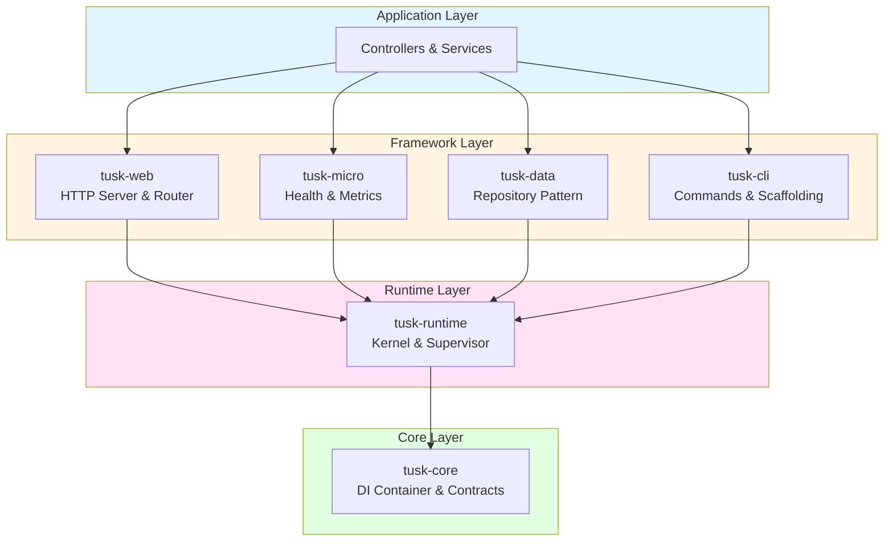

# Tusk Framework

> **Domain-first PHP framework for modern web applications and microservices**

[](https://opensource.org/licenses/MIT)
[](https://www.php.net/)
[](https://tusk-framework.github.io/tusk-docs/)

---

## What is Tusk?

Tusk is a **lightweight, high-performance PHP framework** that puts your domain logic first. Built from the ground up with modern PHP 8.2+ features, it provides everything you need to build production-ready APIs and microservices—without the bloat.

### Key Features

- **Zero-Dependency CLI** - Scaffold projects instantly with a single PHAR file
- **Native HTTP Server** - Run without Nginx/Apache using pure PHP sockets
- **Powerful DI Container** - Attribute-based dependency injection
- **Repository Pattern** - Clean data access with resilient PDO connections
- **Microservice Ready** - Built-in health checks, metrics, and RPC interfaces
- **Process Supervision** - Long-running workers with automatic restart

---

## Quick Start

```bash
# Download the CLI
wget https://github.com/tusk-framework/tusk-cli/releases/latest/download/tusk.phar

# Create a new project
php tusk.phar init my-api

# Start developing
cd my-api
composer install
php ../tusk.phar run public/index.php
```

**Your API is live at `http://localhost:8080`**

---

## Architecture

Tusk is built on a **modular, layered architecture** that promotes clean code and separation of concerns:



---

## Philosophy

### 1. Domain-First
Your business logic comes first. The framework adapts to your domain, not the other way around.

### 2. Explicit over Magic
No hidden conventions or "magic" behavior. Every dependency is clear and traceable.

### 3. Performance Matters
Native implementations, minimal overhead, and efficient resource usage.

### 4. Developer Experience
Fast scaffolding, clear error messages, and comprehensive documentation.

---

## Ecosystem

| Repository | Description | Status |
|------------|-------------|--------|
| [tusk-core](https://github.com/tusk-framework/tusk-core) | Dependency injection & contracts | Stable |
| [tusk-runtime](https://github.com/tusk-framework/tusk-runtime) | Process manager & supervisor | Stable |
| [tusk-web](https://github.com/tusk-framework/tusk-web) | HTTP server, router, request handling | Stable |
| [tusk-data](https://github.com/tusk-framework/tusk-data) | Database abstraction & repositories | Stable |
| [tusk-micro](https://github.com/tusk-framework/tusk-micro) | Microservice utilities | Stable |
| [tusk-cli](https://github.com/tusk-framework/tusk-cli) | Command-line tools | Stable |
| [tusk-docs](https://github.com/tusk-framework/tusk-docs) | Official documentation | Live |

---

## Learn More

- **[Documentation](https://tusk-framework.github.io/tusk-docs/)** - Complete guides and API reference
- **[Quick Start Tutorial](https://tusk-framework.github.io/tusk-docs/getting-started/quickstart/)** - Build your first app in 5 minutes
- **[Architecture Guide](https://tusk-framework.github.io/tusk-docs/architecture/overview/)** - Deep dive into framework design
- **[Discussions](https://github.com/orgs/tusk-framework/discussions)** - Ask questions and share ideas

---

## Contributing

We welcome contributions! Whether it's:

- Bug reports
- Feature requests
- Documentation improvements
- Code contributions

Check out our [Contributing Guide](https://github.com/tusk-framework/.github/blob/main/CONTRIBUTING.md) to get started.

---

## License

Tusk Framework is open-source software licensed under the [MIT License](https://github.com/tusk-framework/tusk-framework/blob/main/LICENSE).

---

<div align="center">

**Built with care by the Tusk community**

[Website](https://tusk-framework.github.io/tusk-docs/) • [Documentation](https://tusk-framework.github.io/tusk-docs/) • [GitHub](https://github.com/tusk-framework)

</div>
