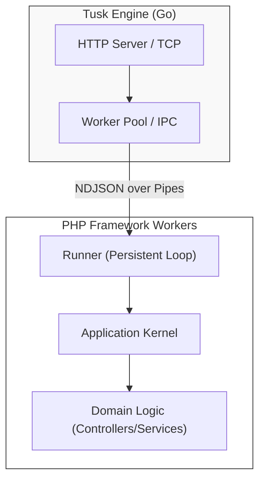

# Tusk Framework

> **High-performance, persistent PHP Runtime & Framework Platform.**

[](https://opensource.org/licenses/MIT)
[](https://www.php.net/)
[](https://tusk-framework.github.io/tusk-docs/)

---

## What is Tusk?

Tusk is a modern platform designed to redefine how PHP applications are built and deployed. It moves beyond the traditional "boot-and-die" lifecycle by combining a **high-performance Go-based master process** with a **persistent PHP framework**.

By keeping your application in memory, Tusk eliminates the overhead of framework bootstrapping on every request, providing sub-millisecond latency and native support for modern architecture patterns.

### Key Features

- **Native Go Engine** - Replaces Nginx and PHP-FPM with a single, self-contained binary.
- **Unified CLI** - One tool (`tusk`) for everything: starting the server, scaffolding, and proxying scripts.
- **Persistent Runtime** - Your application stays alive across requests, maintaining state and connection pools.
- **Zero-Dependency Installation** - Managed portable PHP runtimes via one-line installers.
- **Domain-First Framework** - Clean architecture (DI, Repository, Events) built specifically for performance.

---

## Quick Start (One-Liner)

Install Tusk and a portable PHP runtime in seconds:

### Linux / macOS
```bash
curl -fsSL https://tusk.sh/install.sh | bash
```

### Windows (PowerShell)
```powershell
iwr -useb https://tusk.sh/install.ps1 | iex
```

### Create & Run
```bash
tusk init my-app
cd my-app
tusk start
```

**Your application is live at `http://localhost:8080`**

---

## Architecture

Tusk follows a **Master-Worker** model where Go handles the networking and PHP handles the logic.



---

## Ecosystem

The Tusk platform is composed of several high-quality components:

| Repository | Description | Role |
|------------|-------------|------|
| [**tusk-engine**](https://github.com/tusk-framework/tusk-engine) | Go Master Process | Request Handling & Process Supervision |
| [**tusk-framework**](https://github.com/tusk-framework/tusk-framework) | PHP Monorepo | Core, Web, Data, and Security Components |
| [**tusk-docs**](https://github.com/tusk-framework/tusk-docs) | Official Documentation | Guides, Tutorials, and API Reference |

---

## Philosophy

- **Domain-First**: Your code describes business rules, not framework boilerplate.
- **Explicit over Magic**: No hidden behavior. Dependencies are pre-compiled and transparent.
- **Performance**: Sub-millisecond latency by default through persistence.
- **Zero-Ops Experience**: Single-binary deployment and managed runtimes.

---

## Learn More

- **[Official Documentation](https://tusk-framework.github.io/tusk-docs/)**
- **[Architecture Deep Dive](https://tusk-framework.github.io/tusk-docs/architecture/overview/)**
- **[CLI Usage Guide](https://tusk-framework.github.io/tusk-docs/guides/cli-usage/)**
- **[GitHub Organization](https://github.com/tusk-framework)**

---

<div align="center">
  <b>Tusk: The Runtime PHP Deserves.</b><br>
  <a href="https://tusk-framework.github.io/tusk-docs/">Website</a> • 
  <a href="https://tusk-framework.github.io/tusk-docs/">Documentation</a> • 
  <a href="https://github.com/tusk-framework">GitHub</a>
</div>
